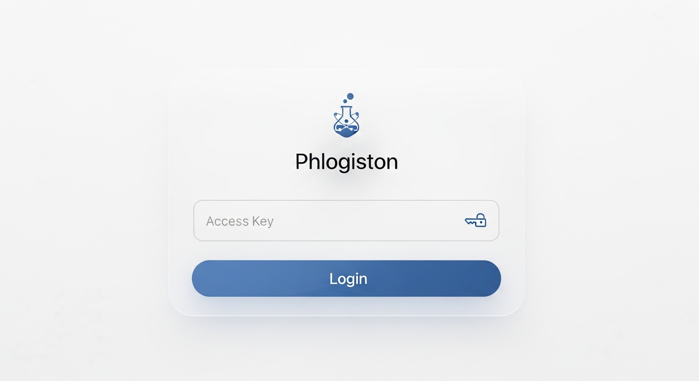

# Phlogiston ⚗️

Электронный лабораторный журнал и калькулятор реагентов для химиков-синтетиков.



## Особенности
- **Офлайн-доступ (PWA)**: Работает без интернета, устанавливается на телефон (iOS/Android) и компьютер как нативное приложение.
- **Химический калькулятор**: Автоматический расчет масс, объемов и молей по заданным эквивалентам. Поддержка растворов (молярность, % масс.) и плотностей.
- **Редактор структур**: Встроенный Ketcher для рисования химических реакций прямо в браузере. Интеграция с PubChem для автозаполнения молярной массы.
- **Двуязычный интерфейс**: Мгновенное переключение между русским и английским языками.
- **Экспорт**: Сохранение синтезов в PDF для распечатки или встраивания в электронные лабораторные журналы (ELN).
- **Свои блоки**: Добавление изображений (TLC, спектры), таблиц (с формулами как в Excel) и чеклистов прямо в протокол синтеза.

## Технологии
- React 19, TypeScript, Vite
- Tailwind CSS, shadcn/ui
- Wouter (Hash Routing)
- Ketcher (редактор структур)
- Vite PWA (Service Workers, offline mode)

## Установка и запуск (для разработки)

```bash
# Установка зависимостей
npm install

# Запуск сервера для разработки
npm run dev
```

## Публикация на GitHub Pages

Проект полностью настроен для деплоя на GitHub Pages как статический сайт. Роутинг реализован через Hash-роутер, поэтому приложение работает из любых подпапок.

1. Создайте репозиторий на GitHub.
2. Включите **GitHub Actions** в настройках репозитория.
3. При пуше в ветку `main` проект будет автоматически собран и опубликован (спасибо встроенному файлу `.github/workflows/deploy.yml`).

## Лицензия
MIT License. Полный текст доступен в файле `LICENSE`.
